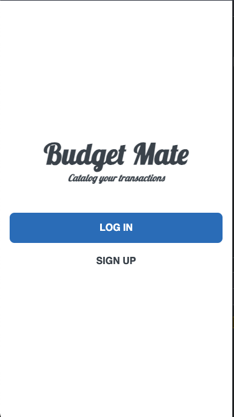
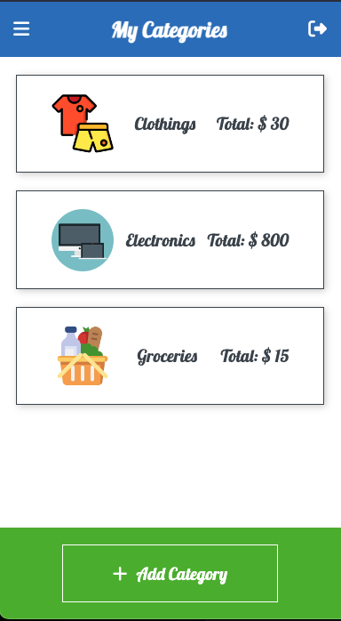

<a name="readme-top"></a>
<h1 align='center'> Budget Mate  💰</h1>

# 📗 Table of Contents

- [📗 Table of Contents](#-table-of-contents)
- [ Budget Mate 💰 ](#-Budget-Mate-)
  - [🛠 Built With ](#-built-with-)
    - [Tech Stack ](#tech-stack-)
    - [Key Features ](#key-features-)
  - [🚀 Live Demo ](#-live-demo-)
  - [💻 Getting Started ](#-getting-started-)
    - [Prerequisites](#prerequisites)
    - [Setup](#setup)
    - [Install](#install)
    - [Usage](#usage)
  - [👥 Authors ](#-authors-)
  - [🔭 Future Features ](#-future-features-)
  - [🤝 Contributing ](#-contributing-)
  - [⭐️ Show your support ](#️-show-your-support-)
  - [🙏 Acknowledgments ](#-acknowledgments-)
  - [❓ FAQ ](#-faq-)
  - [📝 License ](#-license-)

<!-- PROJECT DESCRIPTION -->

# Budget Mate 💰 <a name="about-project"></a>

Budget Mate is a web application that helps users keep track of their personal finances and budgeting goals. The application allows users to create a budget and track their spending across different categories such as groceries, transportation, and entertainment.
<br>


## 🛠 Built With <a name="built-with"></a>

### Tech Stack <a name="tech-stack"></a>

<details>
  <summary>Server</summary>
  <ul>
    <li><a href="https://guides.rubyonrails.org/">Ruby on Rails</a></li>
  </ul>
</details>

<details>
<summary>Database</summary>
  <ul>
    <li><a href="https://www.postgresql.org/">PostgreSQL</a></li>
  </ul>
</details>

## 🚀 Live Demo <a name="live-demo"></a>

- [Live Demo](https://budget-mate-z4ax.onrender.com//)

### Key Features <a name="key-features"></a>

- **Supports custom categories for expenses**
- **Tracks user expenses(transactions) across different categories**
  
<p align="right">(<a href="#readme-top">back to top</a>)</p>

## 💻 Getting Started <a name="getting-started"></a>

To get a local copy up and running, follow these steps.

### Prerequisites

In order to run this project you need:

```sh
 gem install rails
```

### Setup

Clone this repository to your desired folder:

```sh
  cd my-folder
  git https://github.com/AmanWorku/BudgetMate.git
```

### Install

Install this project with:

```sh
  cd BudgetMate
  bundle install
```

### Usage

To run the project, execute the following command:

```sh
  rails server
```

### Run tests

To run tests, run the following command:

```sh
  rails rspec spec
```

<p align="right">(<a href="#readme-top">back to top</a>)</p>

## 👥 Authors <a name="authors"></a>

### 👤 **Aman Worku**:
- GitHub: [@Aman_on_GitHub](https://github.com/AmanWorku)
- Twitter: [@Aman_on_Twitter](https://twitter.com/Amexworku)
- LinkedIn: [@Aman_on_LinkedIn](https://www.linkedin.com/in/aman-worku-tsegaw/)


## 🔭 Future Features <a name="future-features"></a>

- [ ] **Create Api endpoints**
- [ ] **Add a page to plan monthly budget**

<p align="right">(<a href="#readme-top">back to top</a>)</p>

## 🤝 Contributing <a name="contributing"></a>

Contributions, issues, and feature requests are welcome!

Feel free to check the [issues page](https://github.com/AmanWorku/BudgetMate/issues).

<p align="right">(<a href="#readme-top">back to top</a>)</p>

## ⭐️ Show your support <a name="support"></a>

If you like this project, please leave a start to support

<p align="right">(<a href="#readme-top">back to top</a>)</p>

## 🙏 Acknowledgments <a name="acknowledgements"></a>

I would like to thank:
- Microverse for this great learning experience !
- [Gregoire Vella on Behance](https://www.behance.net/gregoirevella) for the [Original Design](https://www.behance.net/gallery/19759151/Snapscan-iOs-design-and-branding?tracking_source=)


<p align="right">(<a href="#readme-top">back to top</a>)</p>

## 📝 License <a name="license"></a>

This project is [MIT](./LICENSE) licensed.

<p align="right">(<a href="#readme-top">back to top</a>)</p>
